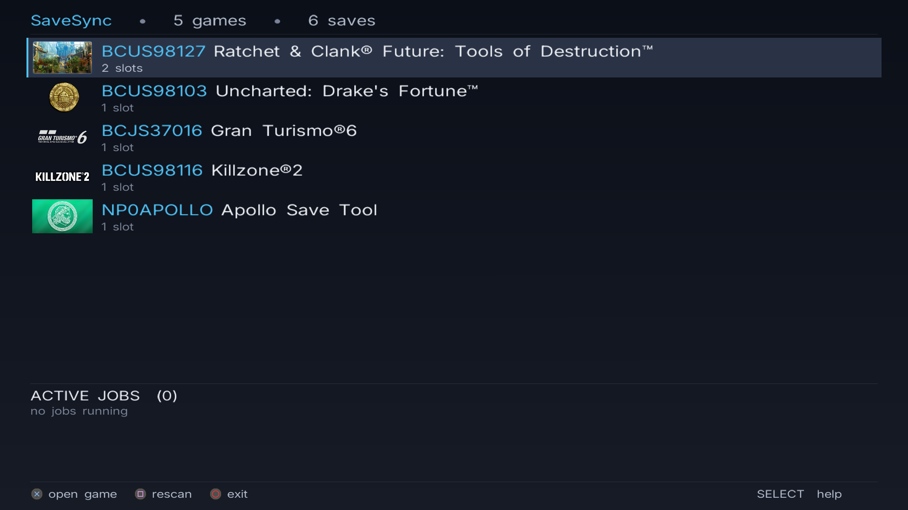
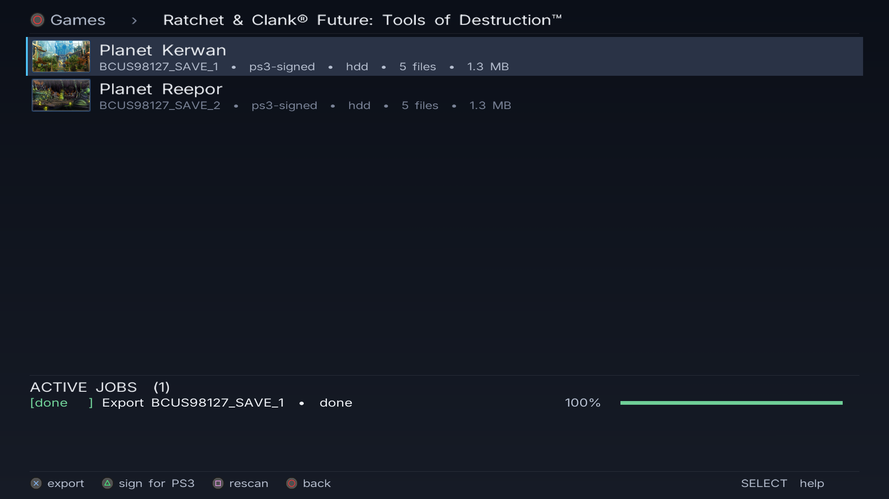
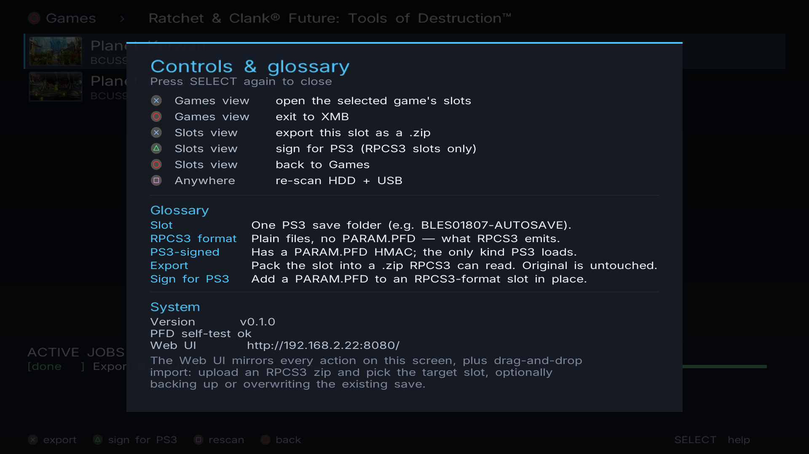

# SaveSync

> RPCS3 ⇄ PS3 savedata converter that runs on real hardware.

SaveSync is a PSL1GHT homebrew that scans your console's save folders, exports them to your computer, and round-trips RPCS3 saves into properly-signed PS3 saves (and back). It runs as a real installed homebrew on a CFW PS3 (XMB Game tab) and exposes both an on-TV UI and a Web UI on `:8080` over the LAN.



## Features

- **On-TV drilldown UI** — Games view groups by `title_id`; pressing × on a game enters its Slots view. ○ goes back, with a system "Exit SaveSync?" prompt at the top level so a casual press can't quit by accident.
- **Native PS3 + RPCS3 round-trip** — sign an RPCS3-format slot in place (rebuilds `PARAM.PFD` HMAC + zeros `account_id` for portability) so PS3's lv2 will load it. Export anything as a `.zip` RPCS3 can read; original is untouched.
- **Web UI on `:8080`** — same actions as the TV UI, plus drag-and-drop import from RPCS3 zips with a slot picker (new slot, replace, optional pre-import backup).
- **Background job queue** — exports and conversions run on worker threads so the UI stays responsive. Active jobs panel shows progress live; the UI auto-refreshes the save list when a mutating job finishes.
- **HDD + USB scan** — `/dev_hdd0/home/<uid>/savedata/` and `/dev_usb000..7/PS3/SAVEDATA/`. Detects each save's flavor (PS3-signed vs RPCS3-plain) by inspecting `PARAM.PFD`.
- **Built on `tiny3d`** — real RSX rendering, ~16ms vsync flips. Worker threads (HTTP + jobs) run on their own stacks; the UI never starves them.

## Screenshots

| Games view | Slots view (with active job) |
|---|---|
|  |  |

| Help / glossary / system info |
|---|
|  |

## Why a real installed pkg (not a fake-self in `/dev_hdd0/tmp/`)

A `.fake.self` launched via webMAN's `/play.ps3` from `/dev_hdd0/tmp/` runs in a sandbox that **cannot read `/dev_hdd0/home/<uid>/savedata/`** — `opendir` returns `EACCES`. The same code installed as a properly-signed homebrew at `/dev_hdd0/game/NP0SVSYNC/USRDIR/EBOOT.BIN` and launched from the **XMB Game tab** runs in a game-process context that has full read access to per-user savedata. SaveSync therefore ships as a `.gnpdrm.pkg`.

## Hardware / firmware requirements

- **Console**: PS3 with CFW (Cobra / Evilnat / Rebug). Tested with webMAN-MOD 1.47.48p.
- **Network**: PS3 and dev machine on the same LAN.
- **For development builds**: PSL1GHT toolchain on a Linux host.
- **For pkg signing**: Docker (the bundled `make_self_npdrm` segfaults on Ubuntu 24.04; the `make pkg` target uses a Docker-driven Ubuntu 22.04 stage to sign EBOOT.BIN).

## Install

1. Build (or download a release) `savesync.gnpdrm.pkg`.
2. FTP-upload to the PS3:
   ```
   curl -T savesync.gnpdrm.pkg ftp://<PS3_IP>/dev_hdd0/tmp/savesync.pkg
   ```
3. Trigger webMAN install:
   ```
   curl 'http://<PS3_IP>/install.ps3/dev_hdd0/tmp/savesync.pkg'
   ```
4. Launch from XMB → Game → SaveSync.

After launch, point your browser at `http://<PS3_IP>:8080/` for the Web UI.

## Controls (TV)

| Button | Games view | Slots view |
|---|---|---|
| ↑ / ↓ | Navigate games | Navigate slots |
| L1 / R1 | Page up / down | Page up / down |
| × (Cross) | Open the selected game's slots | Export this slot as a `.zip` |
| △ (Triangle) | — | Sign for PS3 (RPCS3-format slots only) |
| □ (Square) | Rescan HDD + USB | Rescan HDD + USB |
| ○ (Circle) | Exit (confirms via system dialog) | Back to Games |
| SELECT | Toggle help / glossary / system info | Toggle help / glossary / system info |

## Web API

| Method | Path | Purpose |
|---|---|---|
| `GET` | `/` | Web UI (HTML + JS) |
| `GET` | `/api/status` | `{ version, console_id_short }` |
| `GET` | `/api/games` | JSON saves bucketed by `title_id` |
| `GET` | `/api/saves` | Flat JSON array of all saves |
| `GET` | `/api/saves/<id>/icon` | `ICON0.PNG` bytes |
| `GET` | `/api/jobs` | JSON array of running / completed jobs |
| `POST` | `/api/jobs` | Enqueue export / convert / import job |
| `DELETE` | `/api/jobs/<id>` | Cancel / remove job |
| `GET` | `/api/jobs/<id>/download` | Zip of a finished export job |
| `POST` | `/api/inspect` | Stage an uploaded RPCS3 zip; returns `{ stage_id, sfo }` for the slot picker |
| `POST` | `/api/upload` | Multipart upload (returns `{ job_id }`) |
| `GET` | `/api/quit` | Clean shutdown (sets `should_quit`, returns to XMB) |

## Project layout

```
savesync/
├── source/
│   ├── main.cpp                # tiny3d render loop, pad input, exit confirm dialog
│   ├── state/
│   │   ├── app_state.{c,h}     # AppState — single source of truth shared with tv_ui
│   │   └── jobs.c              # background job queue
│   ├── ui/
│   │   ├── tv_ui.cpp           # breadcrumb + games/slots views + jobs strip + footer
│   │   ├── icon_cache.c        # PNG → RSX texture cache (libpng-driven, lazy)
│   │   └── fonts/, buttons/, logos/
│   ├── http/                   # webMAN-style per-conn worker HTTP server (port 8080)
│   │   ├── routes.c            # URL dispatch (/api/*)
│   │   ├── json_helpers.c      # tiny JSON serializers
│   │   └── embedded_assets.h   # generated: index.html + app.js as C arrays
│   ├── ps3http/                # reusable PSL1GHT libnet HTTP server library
│   ├── savedata/
│   │   ├── scan.c              # /dev_hdd0/home + /dev_usb scanners
│   │   ├── sfo.c               # PARAM.SFO reader/writer (LE↔BE byte-swap)
│   │   ├── pfd.c               # PARAM.PFD HMAC (ported from apollo-ps3)
│   │   └── convert.c           # RPCS3 ↔ PS3 round-trip
│   ├── transport/              # zip + multipart helpers
│   ├── fonts_ttf/              # Inter TTF embedded for ps3ui_text
│   └── web/                    # source HTML + JS (embedded into the .self at build time)
├── pkgfiles/
│   └── ICON0.PNG               # XMB icon
├── tools/
│   ├── build_pkg.sh            # Docker pipeline: signs EBOOT, builds .pkg
│   └── embed_assets.sh         # generates source/http/embedded_assets.h from web/
├── sfo.xml                     # PARAM.SFO definition
└── Makefile                    # build + pkg pipeline
```

## Build

```bash
# .self only (and .fake.self for play.ps3-from-tmp dev launches):
make

# Full .pkg (Docker pipeline signs EBOOT.BIN with make_self_npdrm in Ubuntu 22.04):
make pkg
# -> savesync.gnpdrm.pkg
# -> build/pkg-stage/pkg/USRDIR/EBOOT.BIN  (signed; useful for hot-swap)
```

After first install, iterate by hot-swapping `EBOOT.BIN` rather than rebuilding the full pkg:

```bash
# 1. Quit the running app:
curl 'http://<PS3_IP>:8080/api/quit'

# 2. Rebuild + hot-swap the signed EBOOT:
make pkg && \
  curl -T build/pkg-stage/pkg/USRDIR/EBOOT.BIN \
       ftp://<PS3_IP>/dev_hdd0/game/NP0SVSYNC/USRDIR/EBOOT.BIN

# 3. Relaunch from XMB Game tab.
```

The hot-swap path skips `install.ps3` entirely (~5× faster than full reinstall) and works as long as `sfo.xml` / `ICON0.PNG` haven't changed — re-install with `install.ps3` only when you've changed pkg-level metadata.

## Acknowledgements

- [Apollo Save Tool](https://github.com/bucanero/apollo-ps3) — reference for PFD HMAC, savedata enumeration, the canary-save trick.
- [PSL1GHT](https://github.com/ps3dev/PSL1GHT) — open PS3 toolchain.
- [tiny3d](https://github.com/wargio/tiny3D) — the rendering library most serious PS3 homebrews use.
- [webMAN-MOD](https://github.com/aldostools/webMAN-MOD) — CFW companion that provides the install endpoint and FTP server.

## License

MIT.
